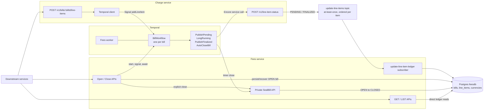
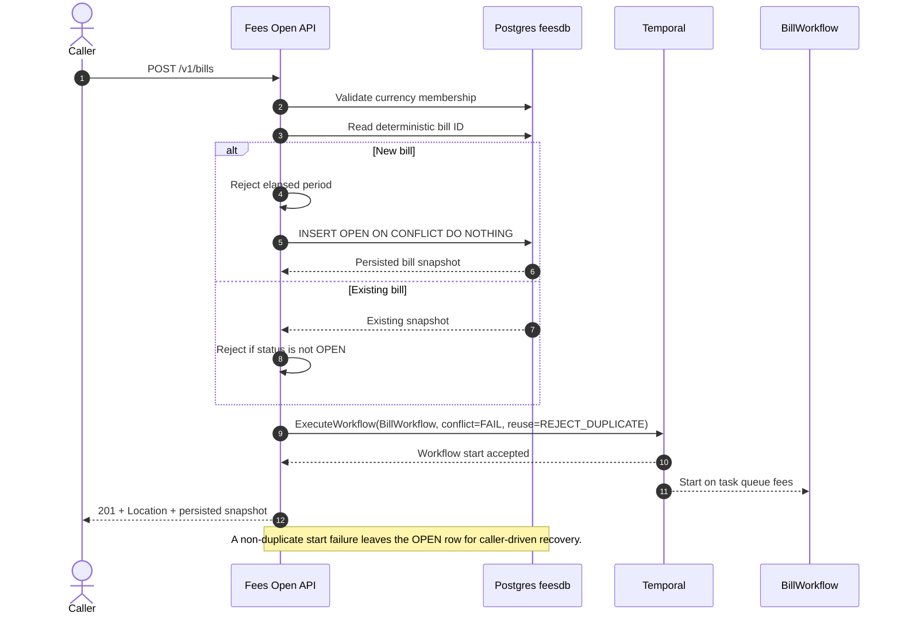
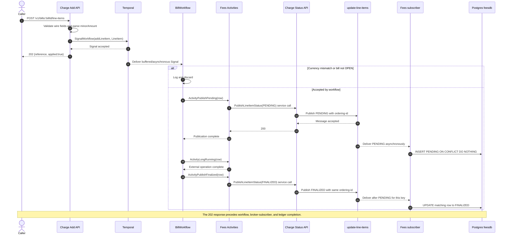
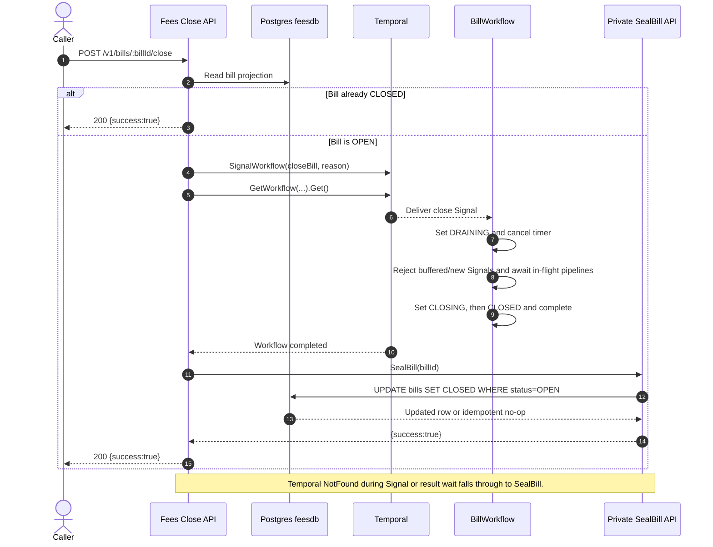
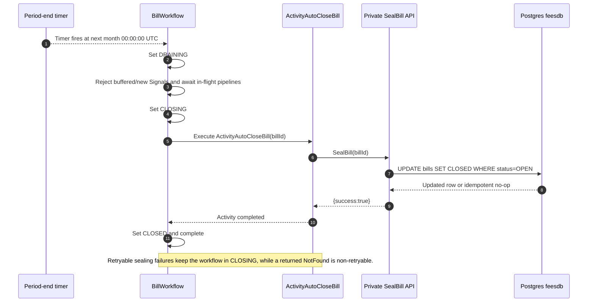

# Fees API V2 Refactor

## Status and authority

This document is the implementation-facing source of truth for the cumulative V2 redesign. It summarizes the final state of the plans in this directory rather than preserving their intermediate designs.

- The implementation in `fees-api-V2` is authoritative when an earlier refactor plan conflicts with a later plan or with the code.
- [PaveBank Fees API PRD v3](../PaveBank_Fees_API_PRD_v3.docx) remains the baseline for requirements that are not superseded below.
- The V2 redesign is a Temporal replay hard cut. It does not preserve compatibility with workflow histories created by the PRD-v3 implementation.

## Redesign summary

V2 separates command ingress from bill lifecycle orchestration and makes line-item processing asynchronous:

1. The `charge` service owns line-item HTTP ingress and accepts valid requests by signaling Temporal.
2. The `fees` service owns bill creation, lifecycle orchestration, reads, and sealing.
3. A `BillWorkflow` exists per `(clientId, currency, period)` and coordinates line-item pipelines and closure.
4. Line-item status events are published to ordered, at-least-once Pub/Sub and persisted by the Fees subscriber.
5. Postgres remains the permanent ledger, but bill totals and item counts include only `FINALIZED` rows.
6. Explicit close waits for the workflow and then seals from the API; timer-driven close seals through a Temporal Activity.

The central semantic change is that HTTP acceptance, workflow processing, broker publication, subscriber completion, and ledger visibility are distinct milestones.

## Final architecture



### Ownership boundaries

| Concern | Owner | Final behavior |
|---|---|---|
| Line-item HTTP ingress | Charge | Validates the wire request, sends `addLineItem`, and returns `202` when Temporal accepts the Signal. |
| Status-event HTTP ingress | Charge | Validates and publishes every accepted status request to `update-line-items`. The endpoint is public in the current implementation. |
| Bill lifecycle | Fees / Temporal | Runs `BillWorkflow`, coordinates line-item pipelines, drains in-flight work, and decides when the bill closes. |
| Bill creation and explicit sealing | Fees API | Persists the OPEN row before workflow start and seals the row after explicit workflow completion. |
| Timer-driven sealing | Fees Activity | `ActivityAutoCloseBill` calls the private `SealBill` endpoint and retries retryable failures. |
| Line-item persistence | Fees subscriber | Inserts PENDING rows and transitions them to FINALIZED from Pub/Sub events. |
| Reads and aggregates | Fees / Postgres | GET and LIST bypass Temporal. Totals and counts include only FINALIZED rows. |

## Interfaces and contracts

### Public HTTP surface

| Endpoint | Owner | Success | Meaning |
|---|---|---|---|
| `POST /v1/bills` | Fees | `201` plus `Location` and the persisted bill snapshot | The OPEN row is committed and Temporal accepted the workflow start. |
| `POST /v1/bills/:billId/line-items` | Charge | `202 {"reference":"...","applied":true}` | Temporal accepted the Signal; no persistence result is implied. |
| `POST /v1/line-item-status` | Charge | Empty `200` | Pub/Sub accepted the status event; subscriber processing is not complete yet. |
| `POST /v1/bills/:billId/close` | Fees | `200 {"success":true}` | The normal path completed workflow draining and the API seal call succeeded; an already-CLOSED row or Temporal-NotFound recovery can also return success. |
| `GET /v1/bills/:billId` | Fees | `200` | Current ledger projection; `includeLineItems=true` includes rows in every status. |
| `GET /v1/bills` | Fees | `200` | Cursor-paginated ledger projection with client, status, currency, and period filters. |

The private `SealBill` Encore API accepts `{"billId":"..."}` and performs an idempotent `OPEN -> CLOSED` update. A missing row is treated as a successful no-op by that private endpoint.

### Line-item contracts

The Charge add request contains:

```json
{
  "reference": "pay-svc-evt-98213",
  "minorAmount": "1500",
  "currency": "USD",
  "feeType": "wire_transfer",
  "description": "Outbound USD wire"
}
```

`minorAmount` is a signed base-10 `int64` encoded as a JSON string. `reference`, `minorAmount`, `currency`, and `feeType` are required; `currency` must be exactly three uppercase letters. Zero and negative amounts are valid.

Charge translates the request into the JSON-free shared Temporal `LineItem` type in `internal/chargecontract`. Its signal name is `addLineItem`.

The status request and Pub/Sub event add `billId` and `status`. The event also carries a producer-owned `orderingId`:

```text
orderingId = billId + "-" + reference
```

The topic is named `update-line-items`, uses `AtLeastOnce`, and sets `ordering-id` as its ordering attribute. Ordering is therefore scoped to one `(billId, reference)` pipeline rather than to the entire bill.

### Status and ledger rules

| Status | Producer behavior | Subscriber behavior | Aggregate effect |
|---|---|---|---|
| `PENDING` | Published before the simulated external transaction. | Parses `minorAmount` and inserts the first payload for `(bill_id, reference)` using `ON CONFLICT DO NOTHING`. OPEN and CLOSED bills are both allowed. | None. |
| `FINALIZED` | Published after the long-running Activity succeeds. | Updates the matching row to FINALIZED without changing `applied_at`. A missing PENDING row is retryable. | Included in total and item count. |
| `FAILED` | Accepted by the status API but not emitted by the workflow. | Logged and acknowledged without mutation. | None. |

Duplicate PENDING events never overwrite the original payload and never regress a FINALIZED row. Duplicate FINALIZED events are idempotent. Itemized reads expose PENDING, FINALIZED, and FAILED rows, while bill totals and `itemCount` use FINALIZED rows only.

The persisted bill states remain `OPEN` and `CLOSED`. Temporal additionally uses `DRAINING` and `CLOSING`; only `OPEN` accepts new accrual pipelines.

## Runtime flows

### 1. Open a bill



For an existing OPEN orphan, retrying the same request attempts workflow start again even after the period has elapsed. An active or previously completed workflow with the same ID produces the duplicate-open `409` response.

### 2. Add and finalize a line item



Each valid Signal starts a concurrent pipeline. The workflow tracks every in-flight pipeline so close and Continue-As-New do not complete while its Activities are still running. It does not wait for Pub/Sub subscriber completion.

### 3. Explicit close



Explicit close has a request-bound persistence window: the workflow can complete before the API commits the CLOSED row. Cancellation or a transient DB failure in that window leaves the ledger OPEN until close is retried.

### 4. Period-end auto-close



Unlike explicit close, auto-close persists the CLOSED ledger state before the workflow completes.

## Reliability and failure semantics

### Acceptance and visibility

- `202` from Add Line Item confirms only that Temporal accepted the Signal. Fresh and duplicate references have the same response.
- Immediate GET or LIST calls may not show an accepted item. Callers that need visibility must poll or use a later status mechanism.
- A mismatched currency or a Signal delivered after the workflow starts draining can receive `202` and then be discarded with structured logs only.
- A successful status API response confirms broker acceptance, not subscriber completion.
- Workflow close waits through the terminal publication attempt for each in-flight pipeline, but not through Pub/Sub delivery or database mutation.

### Retries and partial outcomes

- PENDING and FINALIZED publication Activities use five attempts. Exhausted PENDING publication drops the pipeline before the long-running operation.
- The long-running Activity uses the existing unbounded retry policy. If it terminates with an error, FINALIZED is not published and an already-delivered PENDING row can remain indefinitely.
- Exhausted FINALIZED publication is logged and tolerated so the workflow can close; the ledger can remain PENDING.
- Subscriber database failures are returned to Pub/Sub for retry. A missing bill blocks its PENDING event; a missing PENDING predecessor blocks FINALIZED for that ordering key.
- At-least-once delivery can duplicate either status. Database uniqueness and monotonic subscriber behavior make redelivery idempotent.
- Encore does not enforce topic ordering in local development. Production ordering is only per derived `orderingId`, not across every item on a bill.

### Endpoint-specific failures

- A Temporal start failure after bill insertion returns `503 open-unavailable` and intentionally leaves a recoverable OPEN row.
- Add Line Item maps Temporal `NotFound`, a completed workflow, a missing client, and generic Signal failures to the same redacted `503 add-line-item-unavailable`. It does not distinguish unknown, closed, or temporarily unavailable bills.
- Explicit close returns `404 bill-not-found` only when the initial ledger preflight finds no bill. Temporal `NotFound` after that preflight calls `SealBill`, which can heal an orphan OPEN row without proving workflow draining occurred.
- Other Temporal or database close failures return redacted `503 close-unavailable`.

### Known architectural risks

- `POST /v1/line-item-status` is public and unauthenticated even though it can mutate the ledger through Pub/Sub. Its validation does not prove workflow state, bill currency, or caller authority.
- CLOSED bills can receive late PENDING inserts and FINALIZED transitions. A closed bill is therefore not an immutable item snapshot; GET results and totals may change after close.
- FAILED events are accepted but intentionally ignored. There is no failure ledger, reconciliation worker, command-status query, or recovery endpoint.
- `orderingId` concatenates unrestricted hyphenated identifiers. Collisions only reduce concurrency, but provider length limits can reject unusually long keys.
- There is no transactional outbox between workflow progress, broker publication, and subscriber persistence. Publication errors may be ambiguous and retries may duplicate events.

## PRD-v3 supersession

| PRD-v3 design | V2 final design | Consequence |
|---|---|---|
| `ActivityPersistBill` runs before workflow handler registration. | Open Bill persists or recovers the row in the Fees API, then calls `ExecuteWorkflow`. | `201` still means the row exists, but start failure can leave an OPEN orphan that a retry must heal. |
| Add Line Item is a synchronous Workflow Update returning fresh-versus-duplicate outcome. | Charge sends an asynchronous Temporal Signal and returns `202/applied:true` for every accepted Signal. | Validation and persistence outcomes are no longer returned to the caller. |
| One Fees service owns all endpoints. | Charge owns line-item and status ingress; Fees owns bill lifecycle, reads, subscriber persistence, and sealing. | External line-item routing is unchanged, but in-process callers use the Charge service. |
| `ActivityPersistLineItem` writes a FINALIZED ledger row directly. | Workflow Activities publish PENDING and FINALIZED events; the Fees subscriber performs both mutations. | Ledger consistency is eventual and depends on broker delivery. |
| `ActivityPersistInvoice` seals the bill from the workflow. | Explicit close seals from the API after workflow completion; timer close uses `ActivityAutoCloseBill` and private `SealBill`. | Explicit and automatic close have different persistence ordering. |
| Close returns the itemized invoice and repeated close returns the same body. | Close returns only `{"success":true}`; callers obtain facts with GET and `includeLineItems=true`. | The close response is idempotent but no longer an invoice snapshot. |
| Closed invoices are immutable and all persisted items contribute to totals. | Late subscriber writes are permitted after closure; only FINALIZED rows contribute to totals/counts. | A CLOSED bill's item list and computed total may continue to change. |

Unchanged PRD-v3 behavior includes deterministic bill IDs, calendar-month periods, signed integer minor units, one currency per bill, Postgres-backed GET/LIST, cursor pagination, and currency membership validation when opening a bill.

## Compatibility and deployment

- Deploy only after affected legacy `BillWorkflow` executions and outstanding old Activity tasks have completed or been intentionally discarded. V2 does not replay Update-based or old Activity histories.
- Deploy the Charge and Fees changes as one coordinated cut because their Signal, status DTO, topic, subscription, and generated service interfaces are coupled.
- The ordered topic assumes no retained backlog of events without `orderingId`. Changing an existing provider resource from unordered to ordered can require resource replacement.
- The current V2 schema must include `line_items.status` with `PENDING`, `FINALIZED`, and `FAILED`; uniqueness on `(bill_id, reference)` remains the idempotency boundary.
- Existing callers must accept the new `202` Add response, eventual reads, the success-only Close response, and the revised `503` mappings.

## Verification

The implementation is covered by Charge API and publisher tests, Fees workflow and Activity tests, subscriber/database tests, read-path tests, worker/service tests, and the optional full-stack lifecycle E2E.

Run from `fees-api-V2`:

```bash
encore test ./...
```

For the full local stack, start Temporal and Encore, then run:

```bash
PAVEBANK_E2E=1 PAVEBANK_API_BASE_URL=http://127.0.0.1:4000 go test -v ./e2e -count=1
```

Key acceptance checks are:

- Open persists before workflow start and can recover an orphan OPEN row.
- Add returns `202` before eventual FINALIZED visibility.
- Duplicate Signals do not double-accrue.
- PENDING precedes FINALIZED for each ordering key.
- Totals and counts exclude non-FINALIZED items while itemized reads retain them.
- Explicit and timer close both drain workflow pipelines, then seal through their respective paths.
- Re-close is idempotent and GET/LIST remain ledger-only.
